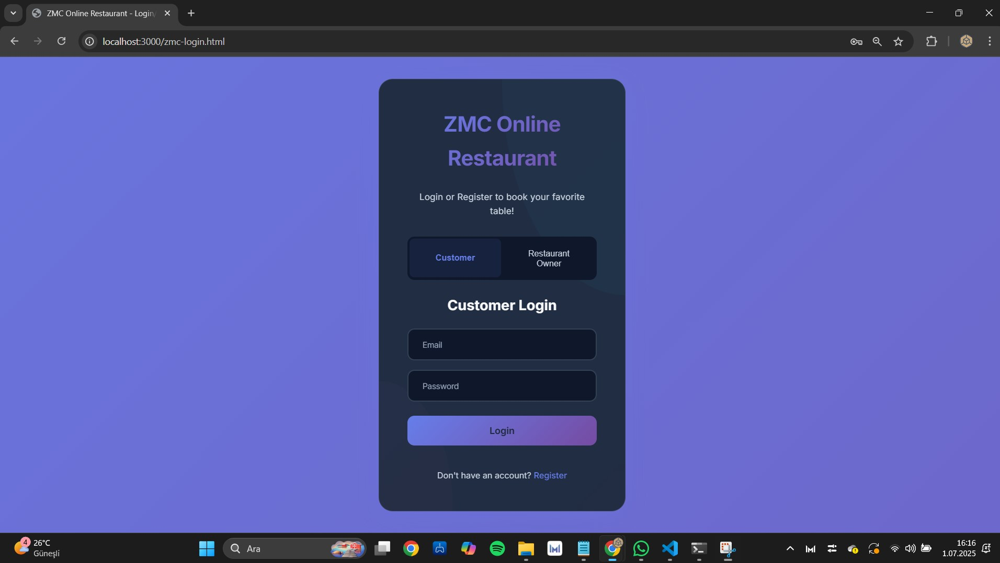
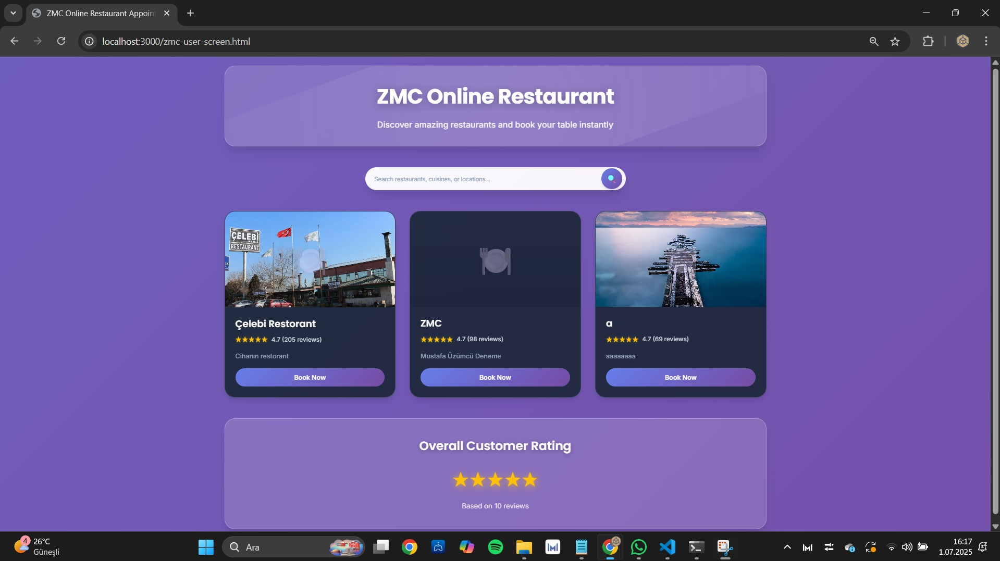
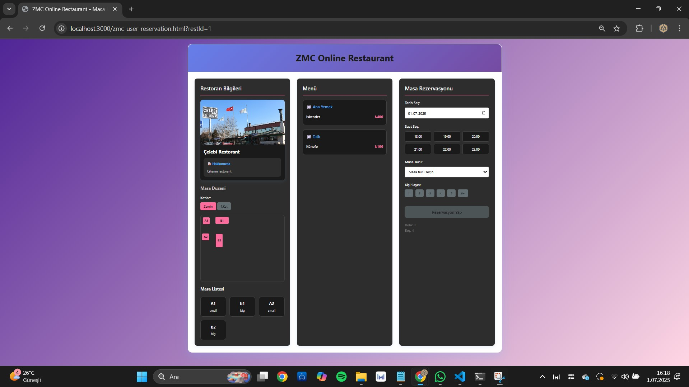
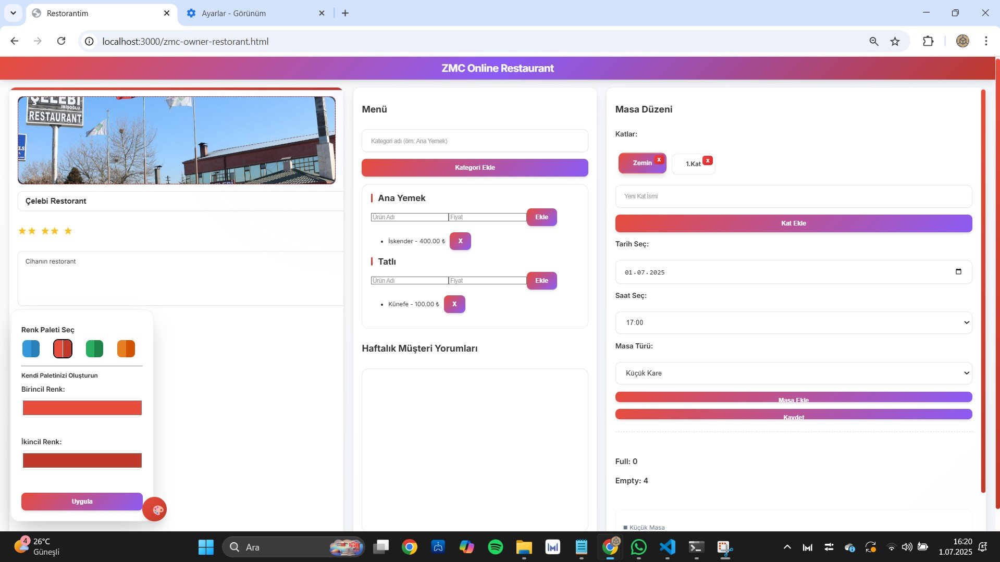
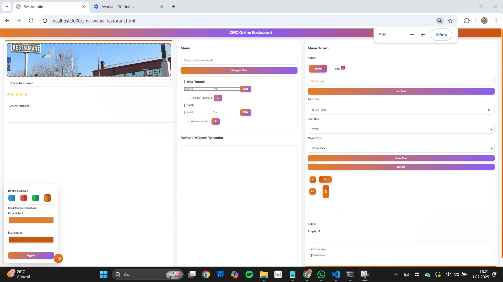
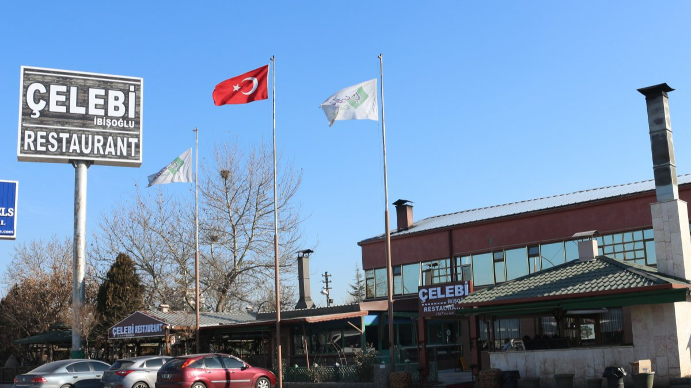

# 🍽️ ZMC Restorant – Online Rezervasyon Sistemi

**ZMC Restorant**, hem kullanıcılar hem de restoran sahipleri için geliştirilmiş kapsamlı bir online masa rezervasyon uygulamasıdır.  
Restoran sahipleri kendi restoranlarını sisteme ekleyip yönetebilir; kullanıcılar ise kayıtlı restoranlardan seçim yaparak tarih, saat ve masa seçimiyle rezervasyon gerçekleştirebilir.

---

## 🔍 Genel Bakış

Bu uygulama, restoran sahiplerinin kendi restoran sayfalarını oluşturmasına, kapak resmi, restoran ismi, hakkında kısmı, menü ve masa düzenlerini yönetmesine olanak sağlar.  
Kullanıcılar ise sistemde kayıtlı restoranları görüntüleyebilir, uygun tarih ve saatte masa rezervasyonu yapabilirler. Sistem dolu masaları engeller ve geçmiş zamana rezervasyon alınmasına izin vermez.

---

## 🗂️ Proje Dosya Yapısı

```
zmc-restorant/
│
├── public/
│   ├── zmc-login.html                 # Giriş / kayıt sayfası
│   ├── zmc-script.js                  # Giriş ve kullanıcı işlemleri scripti
│   ├── zmc-style.css                  # Genel stil dosyası
│
│   ├── zmc-owner-restorant.html       # Restoran sahibi paneli
│   ├── zmc-owner-restorant.js         # Masa/menü düzenleme scripti
│   ├── zmc-owner-restorant.css        # Stil dosyası
│
│   ├── zmc-user-screen.html           # Kullanıcı restoran seçimi sayfası
│   ├── zmc-user-reservation.html      # Rezervasyon ekranı
│
├── uploads/                           # Kapak resimleri
│   └── cover_*.png
│
├── pictures_of_zmc_restorant/        # Ekran görüntüleri
│   └── *.jpg
│
├── database/
│   ├── ZMCOnlineRestorant.mdf         # Veritabanı dosyası
│   ├── ZMCOnlineRestorant_log.ldf     # Log dosyası
│   └── sql diagram.jpg                # Veritabanı diyagramı
│
├── server.js                          # Node.js backend
├── package.json                       # Proje bağımlılıkları
├── README.md                          # Bu dosya
```

---

## ⚙️ Kullanılan Teknolojiler

- **Frontend:** HTML, CSS, JavaScript  
- **Backend:** Node.js  
- **Veritabanı:** Microsoft SQL Server (SSMS)  
- **IDE:** Visual Studio Code  
- **Dosya Yönetimi:** Resimler `uploads/` klasöründe tutulur

---

## 👥 Roller ve Yetkiler

### 👤 Kullanıcı (USER)
- Sisteme kayıt olabilir veya giriş yapabilir.
- Restoran arayabilir ya da önerilen restoranlardan seçim yapabilir.
- Restoranın kapak resmi, açıklaması, menüsü ve masa düzenini görüntüleyebilir.
- Tarih, saat ve masa seçerek rezervasyon yapabilir.
- Dolu veya geçmiş zamana rezervasyon yapılması engellenir.

### 🧑‍🍳 Restoran Sahibi (OWNER)
- Giriş sonrası restoran oluşturabilir.
- Kapak resmi, restoran adı, açıklama, menü, kat bilgisi ve masa düzeni ekleyebilir.
- Masaları döndürebilir, masa adlandırmaları otomatik yapılır.
- Dolu/boş masaları renklerle takip edebilir.

---

## ✨ Özellikler

- ✅ Kayıt ve Giriş Sistemi  
- 📂 Restoran Seçme ve Görüntüleme  
- 🧾 Dinamik Menü ve Masa Düzeni Oluşturma  
- 🏢 Katlı Rezervasyon Sistemi  
- 🔒 Rezervasyon Doluluk Kontrolü  
- 🔁 Masa Rotasyonu  
- 👥 Kullanıcı ve Sahip Rol Ayrımı

---

## 🧪 Veritabanı

`database/` klasöründe yer alan dosyalar:

- `ZMCOnlineRestorant.mdf` — SQL Server veri dosyası  
- `ZMCOnlineRestorant_log.ldf` — Transaction log  
- `sql diagram.jpg` — Tablolar ve ilişkiler diyagramı  

📌 `.mdf` dosyasını SSMS üzerinden **Attach** ederek kullanabilirsiniz.

---

## 🚀 Projeyi Çalıştırma

1. Projeyi klonlayın:
   ```bash
   git clone https://github.com/kullaniciadi/zmc-restorant.git
   cd zmc-restorant
   ```

2. Bağımlılıkları yükleyin:
   ```bash
   npm install
   ```

3. SQL Server Management Studio'yu açın ve `ZMCOnlineRestorant.mdf` dosyasını attach edin.

4. `server.js` dosyasındaki veritabanı bağlantı ayarlarını düzenleyin.

5. Sunucuyu çalıştırın:
   ```bash
   node server.js
   ```

6. Tarayıcıda şu adresi açarak giriş yapın:
   ```
   http://localhost:3000/public/zmc-login.html
   ```

---

## 📸 Ekran Görüntüleri

### Giriş ve Kullanıcı Arayüzü

- 
- 
- 
- 

### Restoran Sahibi Paneli

- 
- 

### Veritabanı Diyagramı

- 

### Örnek Kapak Resimleri

- 
- 

---

## 📄 Lisans

Bu proje herhangi bir açık lisans kapsamında yayınlanmamıştır.

---

## 🤝 Katkı Sağlamak

Katkı sağlamak isterseniz:

1. Fork alın  
2. Yeni bir branch açın:  
   `git checkout -b yeni-özellik`  
3. Gerekli değişiklikleri yapıp commit edin  
4. Pull Request gönderin ✅

---

## 🔚

ZMC Restorant sistemi tam anlamıyla kullanıcı dostu, dinamik ve geliştirilebilir bir altyapıya sahiptir.  
Destek veya öneri için iletişime geçebilirsiniz.